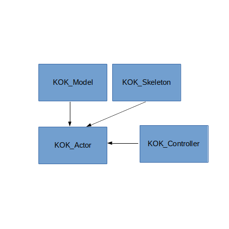

# KOK_ENGINE
  A modular game engine

  Things are coming together nicely. The focus for this engine will end up being 3rd person type shooters.

  I'll add the documentation a bit at a time.

  **Currently working on integrating PhysX**

## Component System

  To create a usable game object, first overload **KOK_Actor** and add pointers as members to all the components needed for the object.

  

  **Code Example:**

  ```c++

  //creating a character class with components
  class MyCharacter : public KOK_Actor
  {
    KOK_Controller * controller;
    KOK_Model * model;
    KOK_Skeleton * skeleton;

    void Update(double time)
    {
      //update components: these classes also derive from KOK_Actor
      controller->Update(time);
      model->Update(time);
      skeleton->Update(time);
    };

    void DeliverMessage(uint64_t subject, MessageData data, KOK_Actor* sender)
    {
      //call for components...  
    };

    void Draw()
    {
      //call for components...
    };
  }

  ```

### Component Types

  * KOK_Mesh
  * KOK_Model (contains a KOK_Mesh)
  * KOK_Skeleton
  * KOK_Light
  * KOK_Controller
  * KOK_ScriptedController
  * KOK_ParticleSystem

## Message Passing

  Components and **KOK_Actor** are decoupled from each other. Use the message passing classes to send messages between components.

  **KOK_PostOffice** is used to queue and deliver messages between **KOK_Actor** objects.
